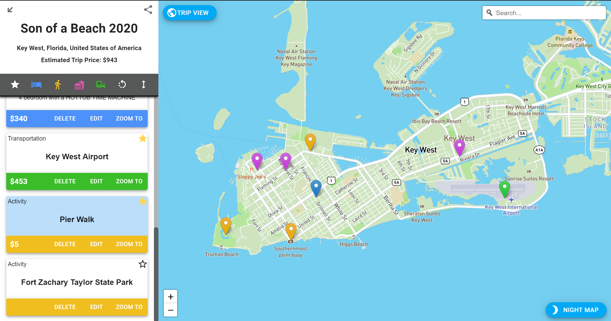
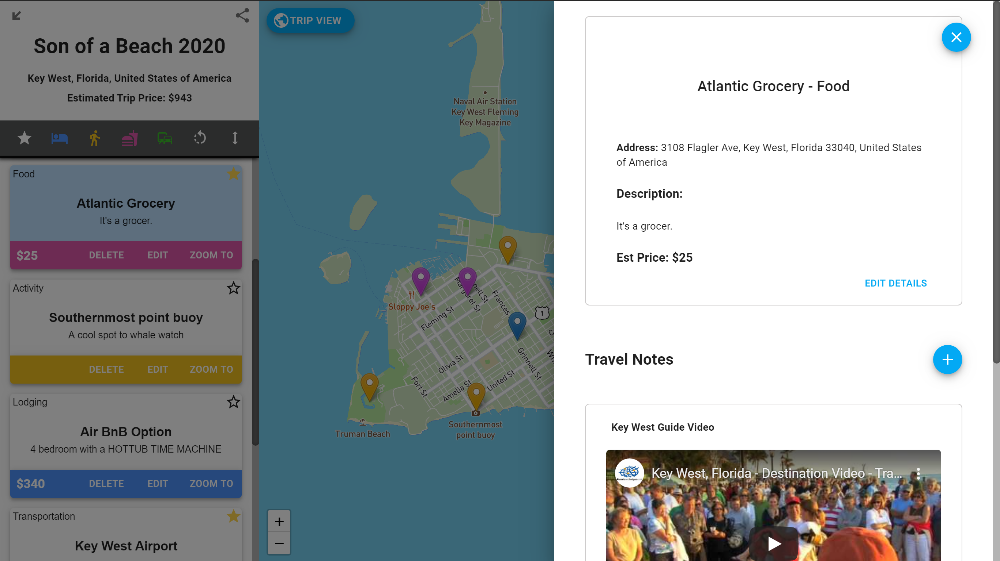
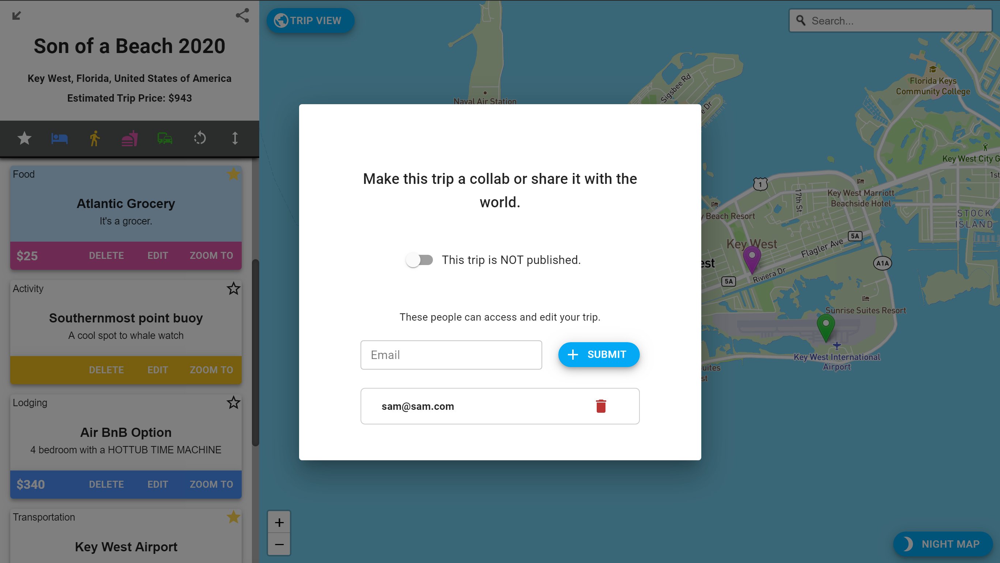
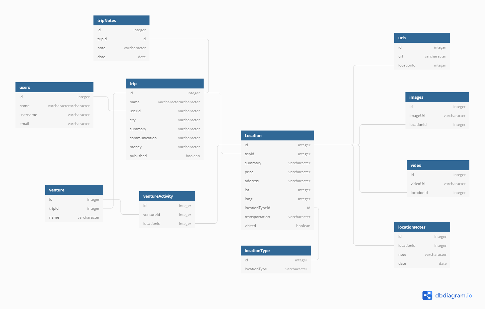

## TripBlazr Ventures

Trip planning and sharing SPA that helps users collaboratively build trips to any destination on earth and then share it with the world; allowing other travelers to follow in their footsteps. App is mobile responsive with features specific to touch devices and mouse pointers.

### Deployed demo:

https://tripblazr.azurewebsites.net/

Built with React, Leaflet, Mapbox Studio Tiles, & Mapbox Geocoding.

### **Mapping Features:**

Pin Clustering, dynamic map zooming based on displayed pins, linked card menu with dynamic scrolling on pin hover.

### **Trip Planning Features:**

Add locations to a trip by clicking on the map or using text search to find addresses or points of interest. In addition, locations found in public trips can be added to a user's trip instantly. Users may assign costs to locations and add notes, urls, or Youtube videos. Users can organize and filter by location type or "starred" locations, and view total associated costs. At any time, hit the Trip View button and the map zooms to fit all currently active locations.

### **Sharing Features:**

Trip sharing settings allow a user's trips to be shared with friends for collaborative planning, or made public for sharing with anyone interested in a particular destination. When a trip page loads, auth checks for current ownersip status: owner, shared with, or public; and sets access accordingly.

### `ERD`

